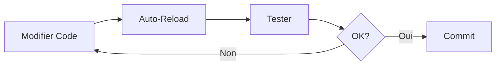
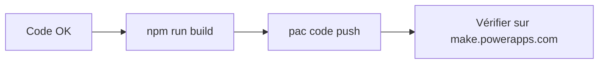

# 🚀 Guide de Démarrage Rapide - VS Code

Guide rapide pour développer et déployer B-Convert avec Visual Studio Code vers Power Apps.

## ⚡ Installation Rapide (5 minutes)

### 1. Cloner et Ouvrir le Projet

```bash
git clone <YOUR_GIT_URL>
cd b-convert
code .
```

### 2. Installer les Extensions VS Code Recommandées

VS Code vous proposera automatiquement les extensions recommandées. Cliquez sur **Installer** dans la notification.

Extensions importantes:
- ✅ ESLint
- ✅ Prettier
- ✅ Tailwind CSS IntelliSense
- ✅ Power Platform Tools (optionnel)

### 3. Installer les Dépendances

Ouvrez le terminal intégré (`Ctrl+~` ou `View > Terminal`):

```bash
npm install
```

### 4. Démarrer le Serveur de Développement

**Option A: Via Terminal**
```bash
npm run dev
```

**Option B: Via VS Code Tasks**
- `Ctrl+Shift+P` → "Tasks: Run Task" → "Dev Server"

L'application s'ouvrira sur http://localhost:5173

## 🔧 Développement dans VS Code

### Structure Recommandée

```
b-convert/
├── 📂 src/
│   ├── 📂 components/     ← Vos composants React
│   ├── 📂 pages/          ← Pages de l'application
│   ├── 📂 data/           ← Données statiques
│   └── 📂 lib/            ← Utilitaires et helpers
├── 📄 power.config.json   ← Config Power Apps
└── 📄 .vscode/            ← Configuration VS Code
```

### Raccourcis Clavier Utiles

| Raccourci | Action |
|-----------|--------|
| `Ctrl+Shift+P` | Palette de commandes |
| `Ctrl+~` | Ouvrir/fermer le terminal |
| `Ctrl+B` | Toggle sidebar |
| `Ctrl+Shift+F` | Recherche dans les fichiers |
| `Ctrl+P` | Recherche rapide de fichiers |
| `F5` | Démarrer le débogage |

### Debugging dans VS Code

1. Assurez-vous que le serveur dev est lancé (`npm run dev`)
2. Appuyez sur `F5` ou allez dans "Run and Debug" (Ctrl+Shift+D)
3. Sélectionnez "Launch B-Convert (Chrome)"
4. Placez des breakpoints en cliquant à gauche des numéros de ligne

### Tasks VS Code Disponibles

Accès via `Ctrl+Shift+P` → "Tasks: Run Task":

- **Dev Server** - Lance le serveur de développement
- **Build** - Compile l'application
- **Preview Build** - Prévisualise le build de production
- **Lint** - Vérifie le code
- **PAC Auth** - Vérifie l'authentification Power Apps
- **Deploy to Power Apps** - Build et déploie vers Power Apps

## 🚢 Déploiement vers Power Apps

### Prérequis

1. **Installer PAC CLI**
   ```bash
   npm install -g @microsoft/powerplatform-cli
   ```

2. **Obtenir votre Environment ID**
   - Allez sur https://make.powerapps.com
   - Sélectionnez votre environnement
   - L'ID est dans l'URL: `environments/{VOTRE-ID}/`

### Étapes de Déploiement

#### 1. Configurer l'Environnement

Éditez `power.config.json` et remplacez `environmentId`:

```json
{
  "environmentId": "VOTRE-ENVIRONMENT-ID-ICI"
}
```

#### 2. Authentification

Dans le terminal VS Code:

```bash
pac auth create --environment VOTRE-ENVIRONMENT-ID
```

Ou utilisez la task VS Code: `Ctrl+Shift+P` → "Tasks: Run Task" → "PAC Auth"

#### 3. Build et Déploiement

**Option A: Via Terminal**
```bash
npm run build
pac code push
```

**Option B: Via VS Code Task**
`Ctrl+Shift+P` → "Tasks: Run Task" → "Deploy to Power Apps"

#### 4. Vérification

1. Allez sur https://make.powerapps.com
2. Cliquez sur **Applications**
3. Trouvez **B-Convert**
4. Cliquez pour ouvrir l'application

## 📝 Workflow de Développement

### Développement Local



1. Lancez `npm run dev`
2. Modifiez le code
3. Le navigateur se recharge automatiquement
4. Testez les changements
5. Committez quand c'est prêt

### Déploiement Power Apps



1. Assurez-vous que le code fonctionne localement
2. Lancez le build: `npm run build`
3. Déployez: `pac code push`
4. Vérifiez sur Power Apps

## 🎨 Personnalisation

### Modifier les Produits

Éditez `src/data/products.ts`:

```typescript
export const products: Product[] = [
  {
    id: "1",
    name: "Mon Produit",
    bottlesPerCrate: 24,
    hectolitersPerCrate: 0.0792,
  },
  // Ajoutez plus de produits...
];
```

### Modifier les Couleurs

Éditez `src/index.css` (section `:root`):

```css
:root {
  --primary: 142 76% 36%;      /* Vert Brasco */
  --primary-light: 47 100% 50%; /* Jaune Brasco */
  /* etc... */
}
```

### Ajouter une Nouvelle Page

1. Créez `src/pages/MaNouvellePage.tsx`
2. Ajoutez la route dans `src/App.tsx`:

```tsx
<Route path="/ma-page" element={<MaNouvellePage />} />
```

## 🔍 Dépannage VS Code

### Le serveur ne démarre pas

```bash
# Nettoyer et réinstaller
rm -rf node_modules dist
npm install
npm run dev
```

### ESLint/Prettier ne fonctionne pas

1. `Ctrl+Shift+P` → "Reload Window"
2. Vérifiez que les extensions sont installées
3. Redémarrez VS Code

### Breakpoints ignorés

1. Vérifiez que les source maps sont activées
2. Relancez le serveur dev
3. Réessayez le débogage avec `F5`

### Erreur PAC CLI

```bash
# Vérifier l'installation
pac --version

# Réinstaller si nécessaire
npm uninstall -g @microsoft/powerplatform-cli
npm install -g @microsoft/powerplatform-cli
```

## 📚 Ressources

### Documentation
- [VS Code Docs](https://code.visualstudio.com/docs)
- [React DevTools](https://react.dev/learn/react-developer-tools)
- [Power Apps Code Apps](https://learn.microsoft.com/en-us/power-apps/developer/code-apps/)
- [PAC CLI Reference](https://learn.microsoft.com/en-us/power-platform/developer/cli/reference/)

### Fichiers Importants
- `README.md` - Documentation principale
- `README_POWERAPPS.md` - Documentation Power Apps complète
- `POWERAPPS_DEPLOYMENT.md` - Guide de déploiement détaillé
- `.vscode/` - Configuration VS Code

## 💡 Conseils Pro

### Productivité
- Utilisez `Ctrl+P` pour naviguer rapidement entre fichiers
- Installez "Error Lens" pour voir les erreurs inline
- Utilisez les snippets React (tapez `rfc` pour un component)

### Git dans VS Code
- Source Control panel: `Ctrl+Shift+G`
- Commit: Tapez le message et `Ctrl+Enter`
- Push/Pull: Cliquez sur l'icône sync en bas

### Extensions Bonus
- **GitHub Copilot** - AI code assistant
- **GitLens** - Enhanced Git integration
- **Todo Tree** - Highlight TODOs in code
- **Auto Rename Tag** - Rename HTML/JSX tags automatically

## 🎯 Checklist de Déploiement

Avant de déployer vers Power Apps:

- [ ] Le code fonctionne en local (`npm run dev`)
- [ ] Aucune erreur ESLint (`npm run lint`)
- [ ] Le build réussit (`npm run build`)
- [ ] `environmentId` est configuré dans `power.config.json`
- [ ] Authentification PAC CLI active (`pac auth list`)
- [ ] Testé le build local (`npm run preview`)
- [ ] Git commits sont à jour

## 👤 Support

**Développé par**: Bienvenu Sedin Massamba

**Questions?**
- Consultez les fichiers README
- Voir la documentation Power Apps
- Vérifiez les logs dans le terminal VS Code

---

**Bon développement! 🚀**
